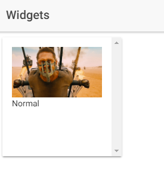

# Guide to: HappyFace Widgets

Starting from version 2.0.4, HappyFace provides Widgets in its Home tab.
In this Guide, you will learn to build your own widget for HappyFace and add it to the HappyFace project.

## Getting started
As well as HappyFace itself, HappyFace Widgets are build as Angular components. 

If you are unfamiliar with that, this guide 
will give you a good overview: [Angular Quickstart](https://angular.io/guide/quickstart).

However, HappyFace Widgets work a little different from Angular Components due the fact that they should be added and removed at runtime.
Lets have a look at a simple example:

```typescript
import { BaseWidget } from "../BaseWidget.js";

export function cls()
{
    return ExampleWidget;
}

export class ExampleWidget extends BaseWidget
{
    static template =
        "<ion-content>" +
        "   " +
        "   <p> {{status.level}} </p>" +
        "</ion-content>";
        
    height:number = 200;
    width:number = 200;
    
    name:string = "Example Widget";

    status:any = {img: "", level: ""};

    constructor() { super(); }

    onInit()
    {
        if(!this.summary) return;
        if(!this.config || !this.config.status)  return;

        this.status.level = this.summary.level;
        this.config.status.find( (element) => {
            if(element.name === this.status.level) this.status.img = element.file;
        })
    }
}
```

This is just a very basic widget which does nothing else but displaying an Image and the String "Title". Lets analyze the source code step by step:

```typescript
import { BaseWidget } from "../BaseWidget.js";
``` 
This statement imports the source code of BaseWidget. All widgets need to extends the BaseWidget class, which provides an entrypoint for the HappyFace system to load and add the widget. Furthermore it binds the data from the currently monitored HappyFace instance to the widget.

```typescript
export function cls()
{
    return ExampleWidget;
}
```
The function cls() gives announces the name of the widget to the loading system. This ensures that every widget can have an own class name. IMPORTANT: Every widget has to have this function so the loading system knows which class to load.

```typescript
export class ExampleWidget extends BaseWidget
```
Every Widget class needs to extend BaseWidget. The class declaration is done by this line.

```typescript
    static template =
        "<ion-content>" +
        "   " +
        "   <p> {{status.level}} </p>" +
        "</ion-content>";
```
Angular components and therefore HappyFace Widgets use HTML files to display their content. The HTML is saved in this template variable. Alternatively we can store it in a seperate file. That would look like this:
```typescript
    static templateUrl = "./assets/widgets/example-widgets/ExampleWidget.html";
```


```typescript
    height:number = 200;
    width:number = 200;
```
The size of the widget is given to the system using this variables (unit: px). In this case a small widget is sufficient.

```typescript
    constructor() { super(); }
```
Since the widget extends the class BaseWidget, its constructor needs to call the constructor of BaseWidget by calling `super()`.

```typescript
    onInit()
    {
        if(!this.summary) return;
        if(!this.config || !this.config.status)  return;

        this.status.level = this.summary.level;
        this.config.status.find( (element) => {
            if(element.name === this.status.level) this.status.img = element.file;
        })
    }
```
The `onInit()` function sets the status variable which stores the data to be displayed. The data is gathered via the usual data gathering process of HappyFace and stored in the variables  `this.summary` and `this.config`. These variables are not accessable during the build time of the widget, therefore the `onInit()` is automatically called once the data is available.


Lets have a look at the results:

 

That looks rather good!
